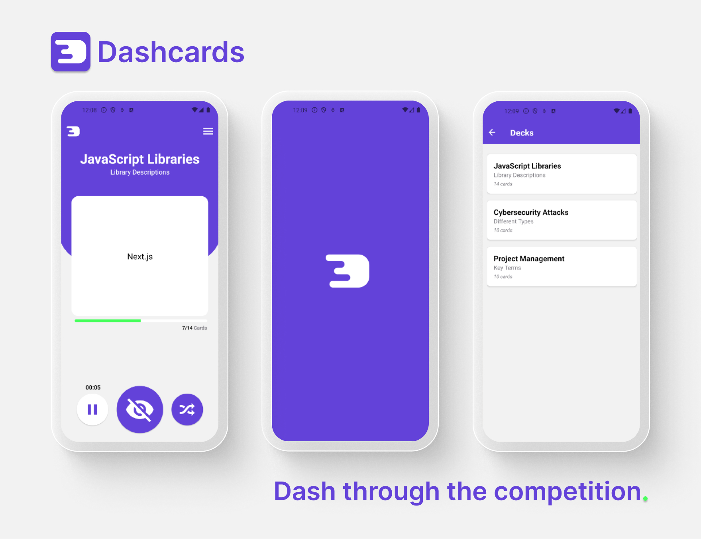

<h1 align="center">
     </img>
</h1>

<p align="center">
  <i>A barebones flashcard application for quick learners that want to dash through the competition.</i><br>
  <i>Built with <a href="https://reactnative.dev/">React Native</a> with <a href="https://expo.dev/">Expo</a>.
</p>

<h5 align="center">
  <a href="https://github.com/Luzefiru/dashcards/stargazers"></a>
  <a href="https://github.com/Luzefiru/dashcards/network/members"></a>
  <a href="https://github.com/Luzefiru/dashcards/pulls"></a>
  <a href="https://github.com/Luzefiru/dashcards/issues"></a>
  <a href="https://github.com/Luzefiru/dashcards/graphs/contributors"></a>
  <a href="https://github.com/Luzefiru/dashcards/blob/master/LICENSE"></a>
</h5>

<h6 align="center">
  <a href="https://github.com/Luzefiru/dashcards/releases"></a>
</h6>

## Screens



## Video Demo (YouTube)

[](https://www.youtube.com/watch?v=iSQYONABlpA)

## Development

1. Install dependencies

   ```bash
   npm install
   ```

2. Start the app

   ```bash
   npx expo start
   ```

In the output, you'll find options to open the app in a

- [development build](https://docs.expo.dev/develop/development-builds/introduction/)
- [Android emulator](https://docs.expo.dev/workflow/android-studio-emulator/)
- [iOS simulator](https://docs.expo.dev/workflow/ios-simulator/)
- [Expo Go](https://expo.dev/go), a limited sandbox for trying out app development with Expo

You can start developing by editing the files inside the **app** directory. This project uses [file-based routing](https://docs.expo.dev/router/introduction).

## License

[GNU General Public License v3.0](https://github.com/Luzefiru/dashcards/blob/main/LICENSE.md)
